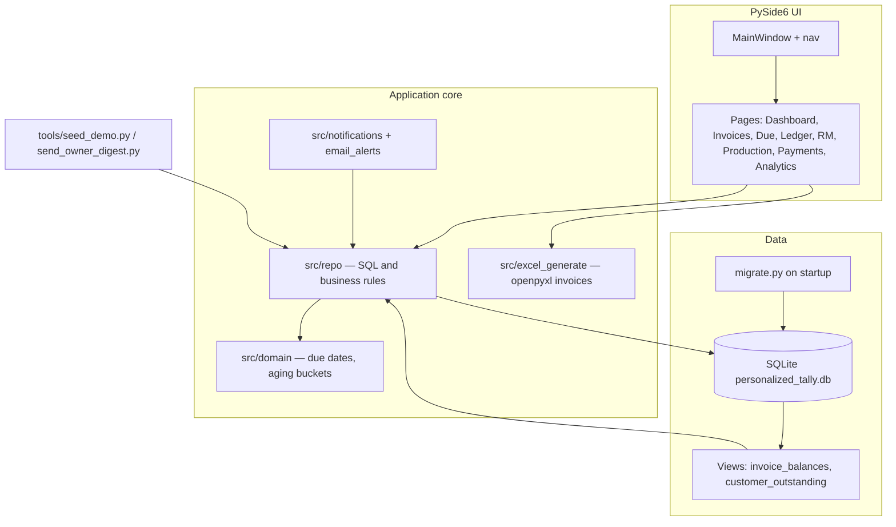

# Personalized Tally (Desktop)

**Personalized Tally** is an offline **Windows** desktop app for small businesses that need **GST-style Excel invoices**, **customers**, **item master**, **customer ledger**, **payments with FIFO allocation**, **due / overdue views**, **soft delete + trash**, and **global search** — without the cost and learning curve of full commercial accounting suites.

Design direction: **zero-training UI** — large navigation, search always visible, clear tables and strong filters.

**Portfolio:** targeting SDE / full-stack / ML roles — see [docs/PORTFOLIO.md](docs/PORTFOLIO.md). **UI refresh** plan: [docs/UI_ROADMAP.md](docs/UI_ROADMAP.md).

---

## Architecture



| Layer | Responsibility |
|--------|----------------|
| **UI** | Qt widgets, filters, role-gated nav (owner vs worker) |
| **Repo** | Customers, invoices, FIFO payments, RM lots, batches, COGS, ledger, search |
| **SQLite** | Single-file DB, WAL, FKs, soft delete, audit log |
| **Excel** | Template fill + GST totals (no Microsoft Excel required) |

---

## Screenshots & demo video

Add files under [`docs/screenshots/`](docs/screenshots/) (see that folder’s README). Link them here when ready:

| | |
|--|--|
| Dashboard |  *(add file)* |
| Due / Outstanding |  *(add file)* |
| Reminders or Analytics |  *(add file)* |

**Loom / walkthrough:** paste your link here after recording (60–90s: login → dashboard → due list → payment or reminders):  
`https://www.loom.com/share/your-link`

Quick capture: `python tools/seed_demo.py --yes` then `python app.py` → sign in as **owner**.

---

## Why this exists

Products like Tally are powerful but **paid** and **steep to learn**. This project focuses on a **narrow, opinionated workflow** (operations first: dues and payments, then invoicing, raw materials, production batches, and analytics) so day-to-day staff can be productive quickly.

---

## Quick start (any machine / Git clone)

Install [Python 3.11+](https://www.python.org/downloads/windows/) from python.org and tick **“Add python.exe to PATH”** (and the **py launcher**). This codebase uses syntax that needs **Python 3.10+** (`str | None`, etc.). If `python` is not found in PowerShell, use the **`py`** launcher.

You might see **`Python was not found… Microsoft Store`** when typing `python`: Windows often puts the Store stub (`WindowsApps\python.exe`) ahead of your real install. Either disable **Settings → Apps → App execution aliases → python.exe** (recommended), or always call **`py -3.12`** / **`py -3.11`** instead of `python` when several versions are installed (`py -0` lists them). Use a **3.10+** interpreter for this project (not 3.9).

```powershell
cd PersonalizedTally
py -3.12 -m venv .venv
.\.venv\Scripts\Activate.ps1
python -m pip install --upgrade pip
python -m pip install -r requirements.txt -r requirements-dev.txt
python -m pytest
python app.py
```

**Sign-in:** The app opens a login dialog first. Default accounts (created on first DB migration): **`owner` / `owner123`** and **`worker` / `worker123`**. Passwords are SHA-256 with a fixed app pepper — suitable for a single desktop; not enterprise IAM. Use **Password…** in the header to change your own password (min 6 characters). **Sign out** returns to the login screen without quitting the app. Main-window **size** and **maximized/normal** state are remembered via Qt `QSettings` (Windows registry key under `PersonalizedTallyDesktop` / app display name).

### Owner vs worker (features)

| Area | Owner | Worker |
|------|--------|--------|
| Dashboard, Invoices, Due / Outstanding, Receivables aging, Ledger | Yes | Yes |
| Raw materials & stock, Production, Payments | Yes | Yes |
| **Analytics** (sales / margin / exports) | Yes | No |
| **Audit log**, **Trash** (restore / purge) | Yes | No |
| **Setup (Seed Data)** | Yes | No |
| **Settings** (paths, backup) | Yes | No |

Workers still use global search; hits that only exist on owner-only screens (e.g. product master via Setup) show a short “owner only” notice instead of opening that page.

### Run the app (each session)

```powershell
cd C:\Users\Saloni\OneDrive\Desktop\PersonalizedTally
.\.venv\Scripts\Activate.ps1
python app.py
```

**PowerShell:** If activation fails with *“running scripts is disabled”*, run once:

`Set-ExecutionPolicy -ExecutionPolicy RemoteSigned -Scope CurrentUser`

—or skip activation and use `.\.venv\Scripts\python.exe -m pip …` and `.\.venv\Scripts\python.exe app.py`, or use **Command Prompt** with `.venv\Scripts\activate.bat`.

If **`pip` / `python` is not recognized** (outside the venv): **Settings → Apps → Advanced app settings → App execution aliases** and turn **off** the “python.exe” / “python3.exe” **Microsoft Store** stubs so the real install wins. Then open a **new** terminal.

**PySide6 / Qt DLL error** (`DLL load failed while importing QtCore` or *the specified procedure could not be found*):

1. Install **[Microsoft Visual C++ Redistributable (x64)](https://learn.microsoft.com/en-us/cpp/windows/latest-supported-vc-redist)** (“latest supported”) and reboot once if it still fails.
2. Recreate the venv with **python.org’s** Python (not Anaconda base): install Python 3.12 from python.org, then  
   `"%LocalAppData%\Programs\Python\Python312\python.exe" -m venv .venv`  
   (adjust folder name if yours differs), activate, and `pip install -r requirements.txt` again. Mixing **conda** Python with **pip**‑installed Qt often breaks DLL loading.
3. `requirements.txt` pins **PySide6 6.8.2** for stability; after changing pins run  
   `pip install -r requirements.txt --force-reinstall`.

**Database:** `data/personalized_tally.db` is created on first run (WAL, foreign keys, migrations on startup). Use **Settings → Back up database now** for a timestamped copy under `data/backups/` (uses SQLite’s `backup()` API, safe while the app is running).

### Demo dataset (portfolio / UI tour)

To **erase** the local DB (including `-wal` / `-shm` sidecars under `data/`) and load **dummy customers, invoices, payments (FIFO), RM lots with reorder demo, production batch + costing**, and audit samples:

```powershell
.\.venv\Scripts\Activate.ps1
python tools/seed_demo.py --yes
python app.py
```

Destructive: your previous **`data/personalized_tally.db`** contents are removed (`tools/seed_demo.py` refuses unless `--yes`). Existing **`data/backups/*.db`** are left untouched — copy those elsewhere first if you need them.

**`import/` and `Output Invoices/`:** These folders are part of the workflow (see `import/README.md` and `Output Invoices/README.md`). **Real customer `.xlsx` files are not committed** (`.gitignore`); use **`seed_demo.py`** for fictional data. After a clone, run seed once to get dummy invoices under `invoices/<FY>/`.

**Audit log:** Timestamps are **IST** (fixed **UTC+5:30**, same as India Standard Time — no `tzdata` dependency). The **Operator** column uses the **signed-in app username**, falling back to the OS login if needed.

**If you had an older build** that used `data/lamitech.db`, the app **renames it once** to `personalized_tally.db` when the new file is missing.

**Requirements:** **Windows** desktop (PySide6). **Invoice `.xlsx`** is built with **openpyxl only** — no Microsoft Excel or COM. Dependencies: `PySide6`, `openpyxl` — see `requirements.txt`.

---

## Tech stack

| Layer | Choice |
|--------|--------|
| UI | PySide6 (Qt) |
| Auth | Local `app_users` table + role (`owner` / `worker`); nav gated in `MainWindow` |
| Data | SQLite (`data/personalized_tally.db`), WAL + foreign keys |
| Invoices | User `.xlsx` template + **openpyxl** fill (headless); rich labels + borders post-process |
| Migrations | `src/db/migrate.py` runs on every app start |

**Invoice totals:** Line amounts and **grand total (O43)** are written in Python (18% GST on taxable subtotal), matching the preview — so bulk import (`data_only`) stays correct **without** opening the file in Excel first. If your template still has **CGST/SGST formula cells** elsewhere, those cells may show old values until you align the template or extend the generator to overwrite them.

---

## Repository layout (high level)

| Path | Role |
|------|------|
| `app.py` | Entry point (login loop, geometry restore, shared DB connection) |
| `src/ui/login_dialog.py` | Sign-in dialog |
| `src/ui/change_password_dialog.py` | Change own password |
| `src/ui/window_geometry.py` | Save/restore main-window geometry (`QSettings`) |
| `src/password_auth.py` | Password hash helper for `app_users` |
| `src/app_info.py` | Display name, DB filename constants |
| `src/ui/main_window.py` | Main window, nav, global search |
| `src/ui/pages/` | Feature screens |
| `src/repo/` | SQL / data access (`core.py`, `models.py`, `helpers.py`) |
| `src/db/migrate.py` | Schema + views |
| `src/excel_generate.py` | Invoice `.xlsx` generation (openpyxl, no COM) |
| `src/backup.py` | SQLite hot-backup (`conn.backup`) → `data/backups/` |
| `src/ui/theme.py` | Fusion + global QSS |
| `src/excel_import.py` | Bulk invoice import (seed) |
| `src/audit_context.py` | IST timestamp + operator hint for audit rows |
| `tools/seed_demo.py` | Wipe DB + load demo fixtures (`--yes`) |

---

## Development & CI

```powershell
pip install -r requirements.txt -r requirements-dev.txt
python -m pytest
```

GitHub Actions (`.github/workflows/ci.yml`) runs **pytest** on **Windows** on push/PR to `main` or `master`.

---

## Roadmap snapshot

**Shipped (desktop):** foundation → ledger / dues / payments (FIFO allocation) → receivables aging → template invoicing → raw materials & lots → production batches & consumption → batch costing & invoice COGS → analytics → audit log → local auth (owner/worker) → **alerts** (low stock reorder, due today, overdue).

**Tests:** `pytest` covers domain helpers, aging, excel totals, backup, login, audit log, **FIFO payment allocation**, **batch RM FIFO consumption**, **invoice/batch COGS**, **ledger running balance**, **trash/restore payments**, notifications, and email digest helpers.

**Still optional / later:** richer manufacturing records (BMR-style), multi-user sync, full in-app historical invoice editing, web API + SPA (see below). **Owner email reminders** — see below.

Deferred / out of scope today: multi-user sync, full in-app historical invoice editing (regenerate-from-template workflow).

---


## Web version / “migrate to web”

Moving this to a **browser app** is **not a small rename**: the **PySide6 desktop UI** is separate from a SPA; invoices today use **openpyxl** (still portable to a server). A practical path for a **product-style** rewrite is:

1. **Keep** SQLite schema + migration ideas and **extract** more pure Python (domain rules, allocation math) with tests — already the direction of `src/domain.py` and `src/repo/`.
2. **Add** a small **HTTP API** (e.g. FastAPI) that wraps the same DB and business operations.
3. **Rebuild** the UI as a **SPA** (React / Vue / Svelte) talking to that API; reuse **server-side** `openpyxl` (or add PDF) for invoices.

That is a **parallel track**, not a flip-a-flag migration — plan it as a second project phase if you need a web portfolio piece for product companies.

---

## UI map (short)

| Page | Purpose |
|------|---------|
| **Dashboard** | Today snapshot — outstanding / dues / MTD & YTD sales, collections, **cash gap**, **gross profit & margin**, invoice counts, masters |
| **Invoices** | Generate invoice Excel + persist header/lines |
| **Due / Outstanding** | Filters, open Excel, trash invoice |
| **Receivables aging** | Outstanding by bucket (current vs 1–30 / 31–60 / 61–90 / 90+ days past due), CSV export |
| **Customer Ledger** | Running balance; payments & invoices |
| **Raw materials & stock** | RM master, receive lots, balances |
| **Payments** | New payment + recent list |
| **Trash** | Restore soft-deleted records |
| **Setup (Seed Data)** | Customers, products, bulk import |
| **Analytics** | KPI grid (billing, GST est., cash-in vs sales, concentration); grouped monthly charts; top customers; exports (**owner** only) |
| **Audit log** | Invoice/payment/stock/batch/settings events — **IST** time + operator — CSV export |
| **Settings** | Template path, output folder, DB path, **backup** + open backups folder |
| **Production** | Batches, consumption, batch costing |

**Header — Reminders:** Low stock (on hand vs reorder), due today, and overdue invoices (compact list). **Overdue** opens the full list on Due / Outstanding.

After `python tools/seed_demo.py --yes`, demo data includes **D-DUE-TODAY-1** and **E-DUE-TODAY-2** (balances due on the seed run date) plus overdue Gamma invoices for testing Reminders.

---

## Owner email reminders

Emails **you** (owner) — not customers. Same content as **Reminders** (low stock, due today, overdue).

| Piece | Role |
|--------|------|
| **Settings → Email reminders** | Set recipient, **Preview digest**, **Send email now** |
| `tools/send_owner_digest.py` | Same send, for Task Scheduler / command line |
| `.env.example` | Copy to `.env` — SMTP host, user, app password (gitignored) |

### Setup (Gmail — free for personal use)

1. Copy `.env.example` → `.env` in the project root.
2. Gmail: 2-step verification → [App password](https://myaccount.google.com/apppasswords) for “Mail” → put in `SMTP_PASS` (not your normal password).
3. Fill `SMTP_USER`, `SMTP_FROM`, and `OWNER_EMAIL` (usually the same Gmail).
4. In the app: **Settings** → **Send reminders to** → **Save Settings** → **Send email now**.

Or from the terminal:

```powershell
.\.venv\Scripts\Activate.ps1
python tools/send_owner_digest.py --dry-run
python tools/send_owner_digest.py
```

### Email without Task Scheduler (PC not always on)

Turn on **Settings → Email digest when I sign in (at most once per day)** and save. The first time you open the app each day as **owner**, it sends the same digest (if `.env` is set). No fixed time, no PC-on-at-9am requirement — only when you actually sign in.

You can still use **Send email now** any time.

### Daily email at a fixed time (optional)

**Task Scheduler** only runs if the **PC is on** at that moment. Alternatives if that is not reliable:

| Approach | Idea |
|----------|------|
| **Sign-in email** (above) | Best fit for a laptop — email when you open the app |
| **Phone** | Gmail app on your phone notifies you when an email arrives |
| **Always-on device** | Old laptop / Raspberry Pi at home running the same script on a schedule |
| **Cloud VM** (~₹300–500/mo) | Copy `data/personalized_tally.db` to a small server; cron runs `send_owner_digest.py` — more setup |

There is no way to send from **your local database** while the PC is off unless something else (another machine or cloud job) has a **current copy** of the DB and runs the script.

### Cost

**Gmail / Outlook SMTP:** free for normal personal volume. **SendGrid / Mailgun:** free tier then paid if you scale up — only needed if Gmail limits are an issue.
